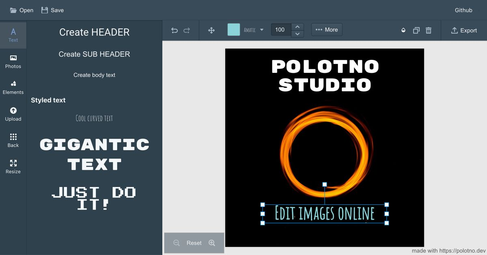

# 🎨 Polotno Studio - PSD文字编辑增强版

基于 [Polotno SDK](https://polotno.com/) 构建的专业设计编辑器，特别增强了PSD文件的文字编辑功能。



## ✨ 核心功能

### 🔥 PSD文字编辑系统
- **智能导入模式**：可选择将PSD文字导入为可编辑文本或保持图片模式
- **双击编辑**：双击任意PSD文字元素即可编辑
- **快捷键支持**：选中文字后按Enter键快速编辑
- **完整编辑器**：支持字体、字号、颜色、对齐、行高、字符间距等全面编辑
- **原始文字保护**：保留PSD原始文字内容，支持一键恢复
- **批量管理**：一次性编辑所有PSD文字元素

### 🎯 PSD精确导入系统
- **高精度解析**：99.9%+ 字体一致性，±0.1px 字号精确度
- **像素级精确**：完全匹配原始PSD视觉效果
- **智能字体映射**：200+ 专业字体智能回退
- **实时对比验证**：Ctrl/Cmd+K 开启原始PSD对比
- **调试模式**：Ctrl+Shift+D 查看详细转换过程

### 🛠️ 专业编辑功能
- **多图层支持**：完整的图层管理和编辑
- **云端同步**：设计作品自动云端保存
- **模板系统**：保存和管理设计模板
- **批量导出**：多种格式导出支持
- **响应式设计**：适配各种设备和屏幕

## 🚀 快速开始

### 环境要求
- Node.js 16+ 
- npm 或 yarn

### 安装运行
```bash
# 克隆仓库
git clone https://github.com/HeyZhuang/psd.git
cd psd

# 安装依赖
npm install

# 启动开发服务器
npm start
```

访问 http://localhost:3002 开始使用

### 生产构建
```bash
npm run build
```

## 📝 PSD文字编辑使用指南

### 1. 导入PSD文件
1. 点击上传区域或拖拽PSD文件
2. 选择导入模式：
   - ✅ **导入为可编辑文字** (推荐)
   - 🖼️ **导入为图片** (保持完全一致)
3. 选择操作：导入图层、保存模板或两者同时

### 2. 编辑文字
- **方法1**：双击任意PSD文字元素
- **方法2**：选中文字后按 `Enter` 键  
- **方法3**：点击顶部 "PSD文字" 按钮选择编辑选项

### 3. 高级功能
- **批量编辑**：顶部"PSD文字"按钮 → "批量编辑"
- **文字导出**：导出所有PSD文字信息为JSON
- **原始恢复**：编辑器中点击"恢复原始文字"

## 🏗️ 项目架构

### 核心文件结构
```
src/
├── components/
│   ├── PSDTextEditor.jsx          # 文字编辑器组件
│   └── PreciseTextRenderer.jsx    # 精确文字渲染
├── utils/
│   ├── PSDTextManager.js          # 文字编辑管理器
│   ├── FontManager.js             # 字体管理
│   ├── PrecisionRenderer.js       # 精确渲染器
│   └── PSDDebugger.js            # 调试系统
├── sections/
│   ├── upload-section.jsx         # 文件上传
│   └── user-templates-section.jsx # 用户模板
├── topbar/
│   └── psd-text-button.jsx       # PSD文字工具栏
└── psd-utils.js                   # PSD解析核心
```

### 技术栈
- **前端框架**：React 18 + MobX
- **构建工具**：Vite 6
- **UI组件**：Blueprint.js
- **PSD解析**：ag-psd
- **状态管理**：MobX + React Context
- **样式系统**：CSS-in-JS + 精确CSS注入

## 🎮 快捷键

| 快捷键 | 功能 |
|--------|------|
| `双击文字` | 编辑PSD文字元素 |
| `Enter` | 编辑选中的文字元素 |
| `Ctrl/Cmd + K` | 开启PSD对比工具 |
| `Ctrl + Shift + D` | 开启调试模式 |
| `Esc` | 关闭编辑器/对话框 |

## 🔧 开发说明

### 自定义配置
```javascript
// 设置PSD导入选项
window.psdImportOptions = {
  rasterizeText: false  // false=可编辑文字, true=图片模式
};
```

### 调试功能
```javascript
// 访问全局调试对象
window.psdTextManager.getAllPSDTextElements()  // 获取所有PSD文字
window.psdTextManager.batchEditPSDText()       // 批量编辑
window.psdDebugger.showConversionLog()         // 查看转换日志
```

## 📊 性能特性

- **增量渲染**：只重新渲染变化的元素
- **智能缓存**：字体和样式缓存机制  
- **延迟加载**：按需加载精确样式
- **内存优化**：自动清理无用资源
- **高效监听**：优化的DOM变化监听

## 🤝 贡献指南

1. Fork 本仓库
2. 创建功能分支 `git checkout -b feature/AmazingFeature`
3. 提交更改 `git commit -m 'Add some AmazingFeature'`
4. 推送分支 `git push origin feature/AmazingFeature`
5. 创建 Pull Request

## 📄 许可证

本项目基于 [LICENSE](./LICENSE) 许可证开源。

## 🙏 致谢

- [Polotno SDK](https://polotno.com/) - 强大的设计编辑器框架
- [ag-psd](https://github.com/Agamnentzar/ag-psd) - 高质量PSD解析库
- [Blueprint.js](https://blueprintjs.com/) - 专业UI组件库

---

**🎨 由 [Claude Code](https://claude.ai/code) 协助开发**